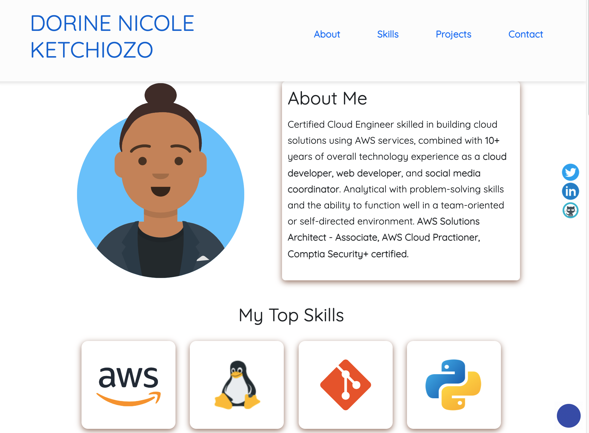

# DORINE NICOLE KETCHIOZ - PORTFOLIO

Welcome to my portfolio. It is fully responsive and uses Bootstrap 5, HTML, CSS and Javascript.

## Author

[LinkedIn:ketchdt](linkedin.com/in/ketchdt) Dorine Nicole Ketchiozo

## Sample Published Website

A live website is already available via this [link](https://ketchdn.netlify.app/)
The final version will be published on AWS.

## Tech Stack

**Client:** HTML, CSS, Bootstrap 5, Vanilla JavaSCript 

## Tools Used

Below are are list of tools used, and the precise things they were used for:

- [Ion Icons](https://ionic.io/ionicons) for hambuger menu bar
- [getavataaars](https://getavataaars.com/) for Dorine Nicole Ketchiozo Avaatar.
- [Icon8](https://icons8.com/) for animated icons and skills icons
- [Formspree](https://formspree.io/) for contact form submision and straight delivery to Gmail.

## Acknowledgements

- [Template](https://github.com/Ksound22/developer-portfolio) from Kolade Chris.

